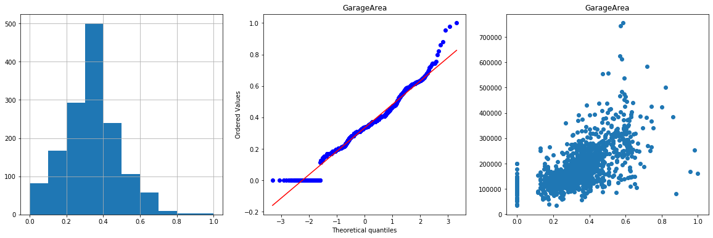

**Project Overview**

•	Created a model that estimates house prices in Ames, Iowa.
•	Gathered 1,460 training examples of houses that were sold from 2006 through 2010
•	Transformed feature distributions to approximate a Gaussian distribution in order to allow certain Machine Learning algorithms to perform better
•	Optimized Linear Regression and Random Forest models using GridSearchCV in order to find the best parameters that can yield the best performance

Code and Resources Used
Python Version: 3.7
Packages: pandas, numpy, matplotlib, seaborn, scipy, pylab, feature_engine, sklearn

**Data Cleaning**

•	Imputed the missing values for each numerical feature by the mean of each feature
•	Visualized all of the numerical variables and removed all of the features that were either impossible to approximate to a normal distribution or wasn’t linearly related to the target (‘SalePrice’).
•	Applied log transformation to ‘1stFlrSF’, ‘LotFrontage’, and ‘GrLivArea’ to minimize the scale of each feature.
•	Treated outliers by capping them with a designated boundary. I calculated the boundary as 1.5 x the Interquartile Range
•	Used a violin plot to make a determination of significance for each categorical variable
•	Imputed missing values for categorical variables by adding a new category ‘Missing’
•	One Hot encoded the remaining categorical variables.
•	Normalized the features so that they were all on the same scale.
•	Scanned the data for any correlated features as it might negatively affect the performance of the model.
o	Performed univariate analysis to determine the best feature in each group of correlated features and remove the rest

**Exploratory Data Analysis**

I’ve determined the most significant features in predicting house prices and plotted there distribution as well as their relationship to the target. I’ve included these features as well as a few others.

**Model Building**

I decided to implement 2 machine learning algorithms: Random Forest and Gradient Boosting Trees. I’ve optimized each model for the best parameters, and I’ve included my results below. Since Kaggle is using the mean squared log error as their metric, that’s what I used. The scores below are for the train set. I will update this readme once my full score has been posted by Kaggle.

•	Random Forest Regressor: 0.00392
•	Gradient Boosting Regressor: 0.01239

